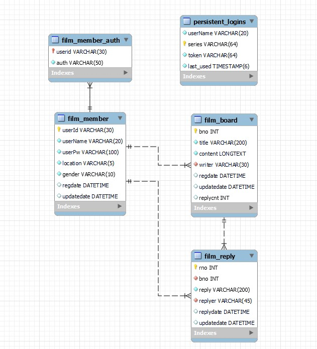

# FilmReaction
> 영화 리뷰 게시판 사이트  
개발 기간: 2023.01.04 - 2023.01.16
  

### 1. 프로젝트 소개
> 게시판 기능을 통한 CRUD기능을 구현하려고 하였고, 이를 영화 리뷰사이트라는 형태로 만들어 보았다.  
화면 구성은 HTML, CSS, JavaScript를 이용하였다. 회원 가입, 로그인, 로그아웃 기능. 영화에 대한 리뷰를 달 수있는 게시판을 만들었다. 
메인 화면은 Rest API를 통하여 영화 정보를 받아와 구성하였고, 댓글 기능을 JSON 형식을 통해 정보를 주고받고, DB에 저장시켰다

### 2. 사용 기술
>_Java11_,  _Spring_,  _Maven_,  _MySQL_,  _Mybatis_,  _Spring Security_,  _Lombok_, _HTML5_, _CSS3_, _Javascript_, _JQuery_ 

### 3.ERD
 

### 4.
